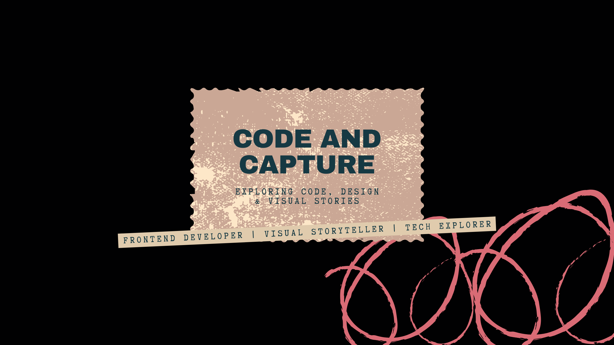

  
  

<h1 align="center">Hi, I'm Arin 👋</h1>

<em>Frontend Developer • Lifelong Learner • Creative Dreamer</em>

---
### ✨ About Me

Hey! I’m Arin from India — passionate about crafting **beautiful user experiences**, exploring the **frontend ecosystem**, and creating art both in code and through the lens.

- 🌱 Exploring **modern frontend frameworks & tools**
- 💡 Building projects that blend **design with functionality**
- 📸 Chasing the perfect shot, one frame at a time
- 📫 Reach me: [arinmandal.dev@gmail.com](mailto:arinmandal.dev@gmail.com)

---

### 🌊 My First VS Code Theme — _Eclipse Wave_

Minimal. Modern. Clean.  
I recently published my first **VS Code theme** designed for a distraction-free coding experience.

🔗 [**Get Eclipse Wave on VS Code Marketplace**](https://marketplace.visualstudio.com/items?itemName=ArinMandal.eclipse-wave)

---

### 📊 GitHub Stats

  

---

  <i>Thanks for visiting — stay curious, stay creative 🚀</i>
### About Me

Hey! I’m Arin from India—passionate about crafting beautiful user experiences, exploring the ever-evolving frontend ecosystem, and creating art both in code and through the lens.

- 🌱 **Exploring Frontend Ecosystem**
- 📸 _Chasing the perfect shot, one frame at a time_
- 📫 **Contact:** [arinmandal.dev@gmail.com](mailto:arinmandal.dev@gmail.com)

---

### GitHub Stats

  

---

  <i>Thanks for visiting! Stay creative 🚀</i>

